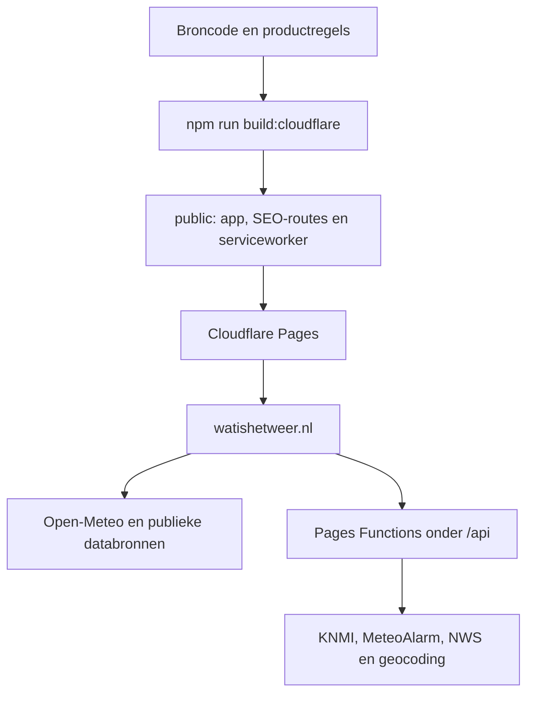

# Overdracht en beheer

Dit document is de operationele ingang voor een nieuwe eigenaar of beheerder van watishetweer.nl. Het bevat geen geheime waarden. Controleer bij een overdracht de accounttoegang en actuele facturen rechtstreeks bij de betreffende leveranciers.

## Product en eigendom

- Canonieke repository: `Tommjoness/watishetweer`.
- Productiedomein: `https://watishetweer.nl/`.
- `https://www.watishetweer.nl/` hoort permanent naar het apexdomein te verwijzen.
- Productieplatform: Cloudflare Pages met Pages Functions.
- Cloudflare Pages-project: `watishetweer`.
- Productiebranch: `main`.
- De live HTML bevat `meta[name="weather-build-sha"]`; die waarde moet gelijk zijn aan de bedoelde `main`-SHA.

Bij verkoop moeten afzonderlijk worden overgedragen of opnieuw worden ingericht: de GitHub-repository, het Cloudflare-account of de Cloudflare-zone en Pages-projecttoegang, het domein bij de registrar, GitHub Actions-secrets en Google Search Console. Domeinregistratie en Search Console staan niet in deze repository.

## Architectuur

De browserapp is statische HTML, CSS en JavaScript. De build stelt de bronlagen samen, genereert de SEO-plaatsroutes en schrijft het definitieve Cloudflare-artifact naar `public/`. Bewerk `public/` niet handmatig.



Belangrijkste onderdelen:

| Onderdeel | Eigenaar in de code |
|---|---|
| hoofdtemplate en browserruntime | `index.html` |
| interpretatie en consumententaal | `interpretatie-engine.js`, `interpretatie.js`, `nederlandse-weergrammatica.js` |
| productie-assemblage | `build-weather.js`, `scripts/postbuild-pipeline.js` |
| plaatsroutes, canonicals en sitemap | `scripts/seo-locations.config.js`, `scripts/generate-seo-location-pages.js` |
| Cloudflare Pages Functions | `functions/`, gedeelde logica in `api/` en `lib/` |
| statische headers en Function-routing | `cloudflare/_headers`, `cloudflare/_routes.json`, `functions/_middleware.js` |
| serviceworker en offline shell | `sw.js`, met een buildgebonden cacheversie in het artifact |
| Pages-projectconfig | `wrangler.jsonc` |
| deploy en domeinkoppeling | `.github/workflows/cloudflare-production.yml` |
| previewdeployments | `.github/workflows/cloudflare-preview.yml` |
| kwaliteits- en productiemonitoring | `.github/workflows/senior-fix-verification.yml`, `.github/workflows/checkpoint-eindronde.yml`, `.github/workflows/production-smoke.yml` |

## Databronnen en afhankelijkheden

| Functie | Bron | Sleutel in deze repository |
|---|---|---|
| actueel weer, uur- en dagverwachting | Open-Meteo | geen |
| luchtkwaliteit en pollen | Open-Meteo Air Quality / CAMS | geen |
| plaats zoeken | Open-Meteo Geocoding | geen |
| reverse geocoding | BigDataCloud, daarna Nominatim-compatible fallback | geen; optionele basis-URL |
| korte neerslag NL/BE | KNMI-dataplatform via de serverlaag | geen geheime waarde in de repository |
| waarschuwingen Europa | MeteoAlarm | geen |
| waarschuwingen VS en ondersteunde gebieden | National Weather Service | geen |
| kaartondergrond en plaatscontext | CARTO / OpenStreetMap-attributie | geen |

Zon- en maanstanden worden lokaal berekend. Behoud alle zichtbare bronvermeldingen. Controleer vóór commercieel gebruik of na een eigendomsoverdracht opnieuw de actuele gebruiksvoorwaarden, fair-usegrenzen en attributie-eisen van iedere leverancier; die voorwaarden staan niet vast in de code.

## Configuratie en secrets

GitHub Actions heeft exact deze twee geheime waarden nodig:

| Naam | Doel | Waar instellen |
|---|---|---|
| `CLOUDFLARE_API_TOKEN` | Pages deployen, projectinstellingen lezen/schrijven, custom domains controleren en de bedoelde zone-regels beheren | GitHub repository Actions secrets |
| `CLOUDFLARE_ACCOUNT_ID` | het juiste Cloudflare-account selecteren | GitHub repository Actions secrets |

De token moet minimaal de acties uit `.github/workflows/cloudflare-production.yml` en de scripts `cloudflare-disable-web-analytics.js`, `cloudflare-disable-rum.js` en `cloudflare-api-rate-limit.js` mogen uitvoeren. De code geeft bij ontbrekende regels-permissies een gerichte fout. Geef geen ruimere accountrechten dan nodig.

Niet-geheime configuratie:

- `CLOUDFLARE_PROJECT` staat in de workflows op `watishetweer`.
- `NOMINATIM_BASE_URL` is optioneel. Zonder waarde wordt de publieke Nominatim-dienst gebruikt. Een ingestelde waarde moet een kale HTTPS-basis-URL zijn, zonder login, query of fragment.
- `WEATHER_BUILD_SHA` wordt tijdens de build vanuit de exacte bron-SHA gezet.
- `EXPECTED_SHA`, `PRODUCTION_ROOT` en de smoke-timeouts zijn alleen verificatie-invoer.

Plaats nooit tokens, account-ID's, registrarcodes of Search Console-verificatiegegevens in broncode, documentatie, issues of workflowlogs. Roteer de Cloudflare-token bij iedere eigendomsoverdracht.

## Ontwikkelen, testen en deployen

Gebruik Node 22 voor de kwaliteitsketen. De productiedeploy gebruikt momenteel Node 24; beide versies worden door de workflows expliciet vastgelegd.

```bash
npm install --ignore-scripts
npm test
npm run build:cloudflare
```

Werk via een branch en pull request. De normale route is:

1. maak een kleine, afgebakende wijziging;
2. draai de relevante lokale tests en daarna `npm test`;
3. open een PR naar `main`;
4. wacht op quality, checkpoint en de dynamische Cloudflare-preview;
5. controleer de immutable preview en laat alleen groen werk mergen;
6. na merge bouwt en deployt `Cloudflare production` exact de `main`-SHA;
7. `WeatherNow production smoke` moet de exacte live SHA, routes, API's en wereldmatrix groen bevestigen.

Een lokaal ontbrekende Chromium/WebKit-installatie is geen productfout. Gebruik in dat geval de vaste Playwright-container uit de GitHub-workflows; merge nooit op basis van alleen een lokaal overgeslagen browserdeel.

## Monitoring en alarmen

`WeatherNow production smoke` draait na iedere push naar `main`, handmatig en ieder uur. De workflow bewaakt onder meer:

- exacte live SHA en Cloudflare-responses;
- apex/www-gedrag, securityheaders, robots, sitemap, 404 en de drie publieke API-contracten;
- Amsterdam, New York, Tokio, Sydney, Singapore en Longyearbyen op mobiel en desktop, inclusief vergelijking met de echte forecastrespons;
- interacties, foutstates, toetsenbordbediening, mobiele touch targets en metadata;
- Chromium desktop en WebKit iPhone, requestaantallen, grafiektijd en horizontale overflow;
- vijf koude mobiele CLS-runs.

GitHub Actions is momenteel het alarmsysteem. Controleer bij overdracht dat de nieuwe eigenaar workflowmails of een andere GitHub Actions-notificatie ontvangt. Er is bewust geen advertentietracking of Cloudflare Web Analytics/RUM actief; beschikbaarheid is daardoor wel bewaakt, maar bezoekersaantallen en conversie niet.

## Kosten en limieten

De repository bevat geen facturen en bewijst daarom geen exact maandbedrag. Leg bij verkoop een aparte kostenbijlage vast met bewijs uit de accounts van de overdrachtsdatum:

- Cloudflare: actief abonnement, Pages/Functions-gebruik, bandbreedte, eventuele overschrijdingen en betaalmethode;
- domeinregistrar: eigenaar, verlengdatum, jaarlijkse prijs en autorisatiecodeprocedure;
- GitHub: Actions-verbruik en eventueel betaald plan;
- databronnen: actuele commerciële voorwaarden, fair use en eventuele toekomstige sleutel- of betaalplicht;
- Search Console of andere externe SEO-tools: eigenaar en toegang, niet kosten uit de repository afleiden.

De rate-limitimplementatie gebruikt bewust één Free-planregel-slot: 60 requests per 10 seconden per IP voor `/api/*`, met een blokkade van 10 seconden. Voeg niet stil een tweede zone-rate-limitregel toe; het deployscript weigert een vreemde regel te overschrijven.

## Incident en herstel

### Productie toont een verkeerde of oude versie

1. Lees `weather-build-sha` uit de live HTML.
2. Vergelijk die waarde met de bedoelde `main`-SHA en de laatste `Cloudflare production`-run.
3. Controleer of zowel `watishetweer.nl` als `www.watishetweer.nl` actief aan Pages gekoppeld zijn.
4. Start de productie-workflow alleen opnieuw als dezelfde huidige `main`-SHA nog leidend is; de workflow blokkeert een verouderde deploy.
5. Verifieer daarna opnieuw de publieke production-smoke.

### Ernstige regressie na een merge

1. Leg fout, tijd, live SHA en getroffen route vast.
2. Revert de foutieve commit in een aparte PR; omzeil CI niet en verplaats `main` niet geforceerd.
3. Laat de normale productieflow de revert-SHA deployen.
4. Eis opnieuw een groene production-smoke en controleer de gebruikerflow die uitviel.

### Externe databron valt uit

Controleer eerst welke bron faalt. De hoofdforecast heeft een begrensde fallbackketen; waarschuwingen en verrijkingen horen fail-closed of met een expliciete niet-beschikbaarstate te eindigen. Presenteer ontbrekende data nooit als nul. Pas providerlogica generiek aan en voeg een regressietest toe; maak geen plaats-specifieke uitzondering.

### Cloudflare-token of account wisselt

1. maak in het juiste account een minimaal bevoegde nieuwe token;
2. vervang beide GitHub Actions-secrets;
3. trek de oude token in;
4. start eerst een preview en daarna pas een normale productieflow;
5. controleer project, domains, RUM/analytics-regels en API-rate-limit via de workflow.

## Hoe wijzig ik X?

| Gewenste wijziging | Route |
|---|---|
| plaats toevoegen of verwijderen | pas `scripts/seo-locations.config.js` aan; draai de SEO-tests, build en live sitemapcontrole |
| metadata of structured data wijzigen | pas de SEO-config/generator aan; controleer root, `/weer/`, plaatsroute, canonical, JSON-LD en sitemap als één geheel |
| weeruitleg of briefing wijzigen | wijzig de canonieke interpretatie-/copy-owner vóór de postbuild; voeg scenario- en browserregressies toe |
| grafiek of weekverwachting wijzigen | wijzig de bestaande eigenaar, niet alleen gegenereerde HTML; test 320–430 px, desktop, Chromium en WebKit |
| Nachtzicht wijzigen | behoud de score-, maan-, pooldag/poolnacht- en kalendergrenscontracten |
| API-provider wijzigen | wijzig gedeelde logica in `lib/`/`api/`; houd de Function-wrapper dun en bewaak timeout, cache, privacy en fail-closed gedrag |
| securityheader wijzigen | houd `cloudflare/_headers` en `functions/_middleware.js` inhoudelijk gelijk en draai `scripts/security-headers.test.js` |
| monitoringfrequentie wijzigen | pas uitsluitend de cron in `.github/workflows/production-smoke.yml` aan en behoud push plus handmatige start |
| domein wijzigen | werk eerst Cloudflare project/domain, canonieke SEO-config, CSP/headers, workflows, robots, sitemap, structured data en smokecontracten als één migratie bij |

## Overdrachtschecklist

- [ ] GitHub-repository en beheerdersrechten overgedragen.
- [ ] Branchregels, Actions en workflownotificaties onder de nieuwe eigenaar gecontroleerd.
- [ ] Cloudflare-account/zone/Pages-project en facturatie overgedragen.
- [ ] Nieuwe minimale Cloudflare-token geplaatst; oude token ingetrokken.
- [ ] Registrar-eigendom, contactgegevens, DNSSEC, verlengdatum en betaalmethode gecontroleerd.
- [ ] `watishetweer.nl` en `www.watishetweer.nl` actief en TLS geldig.
- [ ] Google Search Console-eigendom en sitemap onder de nieuwe eigenaar gecontroleerd.
- [ ] Actuele bronvoorwaarden en attributies commercieel beoordeeld.
- [ ] Preview, merge, production deploy en recoveryprocedure eenmalig door de nieuwe beheerder uitgevoerd.
- [ ] Exacte live SHA en volledige production-smoke groen vastgelegd.
- [ ] Kostenbijlage met actuele accountfacturen toegevoegd aan de verkoopstukken.
